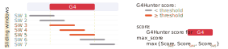
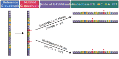

# Introduction


G-quadruplexes (G4s) are non-canonical secondary structures that usually form 
in G-rich regions [@varshney2020regulation]. Bioinformatic studies have 
revealed the preferential enrichment of G4s in human functional regions, 
including promoters, telomeres, 
and enhancers [@huppert2007g; @phan2002human; @zhang2024g]. 
Notably, G4s arise from specific sequence motifs that 
enable their structure formation.
These motifs can be disrupted by single nucleotide variants (SNVs) — 
the most common genetic variants.

`G4SNVHunter` is designed to evaluate the impact of SNVs on G4 
formation, but it can also assess insertions and deletions (indels) 
and other short nucleotide variants. 
This package leverages one of the most popular G4 structure prediction 
algorithms, G4Hunter [@bedrat2016re], conceptualized by Mergny et al. 
[@bedrat2016re], to evaluate the propensity of G4 formation before and 
after the introduction of variants.
Users can then design *'wet'* experiments based on `G4SNVHunter` 
output to explore and validate how variants affect biological functions 
through their impact on G4 structures.

# Installation

As the first step, you need to install `G4SNVHunter`, which can be done with a 
simple command, 
please ensure that your network connection is stable.

```{r install_G4SNVHunter, eval = FALSE}

# Currently, install from github is recommended, 
# as it provides the latest version.

devtools::install_github("rongxinzh/G4SNVHunter", dependencies = TRUE)

```

*NOTE*: alternatively, `G4SNVHunter` can be installed from Bioconductor. 
However, we *currently do not recommend* using the 
Bioconductor release version, as significant updates have been made that 
will not be included until the second half of 2025.

Then load `G4SNVHunter` to access its functions.

```{r load_G4SNVHunter, message = FALSE}

library(G4SNVHunter)

``` 

# Load Tutorial Packages

During this tutorial, we need to use a few additional packages. 
Since we specified `dependencies = TRUE` when installing `G4SNVHunter` package, 
these additional packages have already been installed.

We can load them directly.

```{r load_required_pkg, message = FALSE, warning = FALSE}

library(BSgenome.Hsapiens.UCSC.hg19)

library(GenomicRanges)

library(DT)

library(rtracklayer)

library(dplyr)

``` 

# Part 1: A Quick Start

The first step is to load your variant file into a `GRanges` object.

```{r quick_start_1, message = TRUE, warning = FALSE}

# Example VCF file; both VCF and MAF are supported
vcf_file <- system.file("extdata", "example_variants_chr16.vcf", package = "G4SNVHunter")
# Load VCF; file_type must be specified
variants <- loadVariant(vcf_file, file_type = "vcf")
seqlevels(variants) <- paste0("chr", seqlevels(variants))

```

Then, load your sequence file into a `DNAStringSet` object.

```{r quick_start_2, message = TRUE, warning = FALSE}

# Sequence file; chromosome 16 (hg19) as an example
hg19 <- BSgenome.Hsapiens.UCSC.hg19
chr16_seq <- DNAStringSet(hg19$chr16)
# Chromosome names are needed for analysis
names(chr16_seq) <- "chr16"

```

Next step is to detect G4s based on your sequence object.

```{r quick_start_3, message=TRUE, warning = FALSE}

# Predict G4s
G4_detected <- G4HunterDetect(chr16_seq)

```

Afterwards, we can calculate the impact of variants on G4 formation.

```{r quick_start_4, message = TRUE, warning = FALSE, results='markup'}

# Predict variants impact on G4 formation
result <- G4VarImpact(G4 = G4_detected, 
                      variants = variants, 
                      ref_col = "REF",
                      alt_col = "ALT")

```

Since most of the variants may have limited impact on G4 formation, we should 
filter the prediction results.

```{r quick_start_5, message = TRUE, warning = FALSE}

# Filter for those with substantial changes in structural formation 
filtered_mutG4s <- filterVarImpact(result, 
                                   mut_score_threshold = 1.2,
                                   score_diff_threshold = -0.35)
print(filtered_mutG4s)

```

Perfectly, we have now obtained the potential variants that can disrupt G4 
formation.

Let's visualize an example. Since this G4 is on the minus strand, 
we specify the `keep_gstrand` as `TRUE` to ensure that the displayed sequence 
corresponds to the G-rich strand.
 
```{r quick_start_6, message = TRUE, warning = FALSE, fig.width = 7, fig.height = 3}

plotImpactedG4(filtered_mutG4s[3], keep_gstrand = TRUE)

```

# Part 2: Advanced Tutorial

## Input Data

To run `G4SNVHunter`, you need to provide two inputs:

 * the genomic sequences (a `DNAStringSet` object)
 
 * the set of variants (a `GRanges` object) 

While the input formats for these data are quite flexible, they must ultimately 
be converted into the appropriate formats: `DNAStringSet` for sequences and 
`GRanges` for variants. 

The initial design of `G4SNVHunter` only focused on SNVs; however, starting 
from version `1.1.0`, it also supports indels, MNVs, and other simple variants.

Detailed descriptions on how to prepare these inputs are provided below.

### Genomic sequences

The genomic sequences refer to the chromosome sequences or fragments where the 
variants are located. These can be entire chromosomes or 
large segments extracted from them.
`G4SNVHunter` will predict G4 structures from the provided sequences and 
assess whether these variants can affect their formation.

Please note that the variant coordinates must be relative to the genomic 
sequence you provide and should be in `1-based` coordinates.

The genomic sequences must be formatted as a `DNAStringSet` object. 
For convenience, we provide the built-in `loadSequence` function to 
facilitate this process. Alternatively, Alternatively, you may load a 
custom sequence file and convert it into a `DNAStringSet` object 
without using the `loadSequence` function.

The `loadSequence` function accepts three input types:

 * A two-column `data.frame`, with the first column containing the sequence 
 identifiers and the second column containing their corresponding sequences. 
 This should be specified using the `genome_seq` parameter.

 * The path to a stored FASTA file. The FASTA file must have a `.fa`, `.fna`, 
 or `.fasta` extension. This should be specified using the `seq_path` 
 parameter.

 * A text file (`.txt`) that stores the sequence identifiers and their 
 corresponding sequences. The first column should contain the sequence 
 identifiers, and the second column should contain the sequences. 
 This should also be specified using the `seq_path` parameter.  
 Note: Please do not include column names in the file!

Here are some examples for you to load sequences into a `DNAStringSet` object 
using `loadSequence` function:

Load from a `data.frame` object

```{r load_seq_from_df_using_loadSequence}

seq_df <- data.frame(chr = c("seq1", "seq2"),
                     sequence = c(paste0(rep("G", 100), collapse = ""), 
                                  paste0(rep("A", 100), collapse = "")))
seq <- loadSequence(genome_seq = seq_df)

```

Load from a `fasta` file

```{r load_seq_from_fa_using_loadSequence}

# File path to the sequences in fasta format
fa_path <- system.file("extdata", "seq.fa", package = "G4SNVHunter")
seq <- loadSequence(seq_path = fa_path)

```

Load from a `txt` file

```{r load_seq_from_txt_using_loadSequence}

# File path to the sequences in txt format
txt_path <- system.file("extdata", "seq.txt", package = "G4SNVHunter")
seq <- loadSequence(seq_path = txt_path)

```

We can also retrieve genome sequences from 
[Bioconductor Annotation Packages](
https://www.bioconductor.org/packages/release/data/annotation/).
While this is convenient, it requires you to install some related packages in 
advance. 
For example:

```{r install_hg19_refseq, message = FALSE, warning = FALSE}

# Load sequence for chromosome 21 (hg19)
hg19 <- BSgenome.Hsapiens.UCSC.hg19
chr21_seq <- DNAStringSet(hg19$chr21)
# Chromosome names are needed for analysis
names(chr21_seq) <- "chr21"

```

### Variant data

The variant data needs to be processed into a `GRanges` object. 
The `loadVariant` function can be used to load the 
`VCF` or `MAF` file into a `GRanges` object.

```{r load_variant_vcf, message = FALSE}

# File path to the VCF file; file_type must be specified
vcf_file <- system.file("extdata", "example_variants_chr16.vcf", package = "G4SNVHunter")
# Load variants from the VCF file
var_vcf <- loadVariant(vcf_file, file_type = "vcf")
seqlevels(var_vcf) <- paste0("chr", seqlevels(var_vcf))
print(var_vcf)

```

Another example to load a `MAF` file.

```{r load_variant_maf, message = FALSE}

# File path to the MAF file; file_type must be specified
maf_file <- system.file("extdata", "example_variants_chr16.maf", package = "G4SNVHunter")
# Load variants from the MAF file
var_maf <- loadVariant(maf_file, file_type = "maf")
# To simplify the dataset, we can select only the columns we needed for our analysis.
var_maf <- subset(var_maf, select = c("Reference_Allele", "Tumor_Seq_Allele2"))
seqlevels(var_maf) <- paste0("chr", seqlevels(var_maf))
print(var_maf)

```

If you have custom variant data, you can easily convert it to a 
`GRanges` object yourself.
For example,

```{r load_SNV, message = FALSE}

# Path to your custom variant file
snp_path <- system.file("extdata", "snp.txt", package = "G4SNVHunter")
# Load your variants into memory
snp <- read.table(snp_path, sep = "\t", header = FALSE)
# Convert them to GRanges
snp <- GRanges(seqnames = snp$V1,
               ranges = IRanges(start = snp$V2, width = 1),
               rsid = snp$V3,
               ref = snp$V4,
               alt = snp$V5)
print(snp)

```

## Predict G4s

### Leverage G4Hunter for G4 detection

You can directly predict G4s from a `DNAStringSet` object using the 
`G4HunterDetect` function. This function is based on the G4Hunter algorithm.

For example,

```{r predict_G4s}

# Sequence file in fasta file format 
fa_path <- system.file("extdata", "seq.fa", package = "G4SNVHunter")
# Load sequences
seq <- loadSequence(seq_path = fa_path)

# Predict G4s
G4_detected <- G4HunterDetect(seq)

```

Then, we can examine the prediction results, which are stored in a `GRanges` 
object. 

You can use functions like `print` to directly view the results. However, in 
this instance, we'll leverage the [`datatable`](https://rstudio.github.io/DT/) 
function to view the predicted G4s, as this method provides a more 
user-friendly display interface. 

Let's take a look at the G4s,

```{r print_G4s, warning = FALSE, message = FALSE}

datatable(as.data.frame(G4_detected), options = list(scrollX = TRUE))

```

This function will return a `GRanges` object containing all potential G4s 
predicted by the G4Hunter algorithms. Fow each row, it mainly includes:

 * The sequence identifier where the G4 is located (`seqnames`),

 * The position of the G4 relative to the sequence you provided 
 (`ranges`, `1-based` coordinate),

 * The strand on which the G4 is located (`strand`), with `+` indicating the G4 
 is on the positive strand, and `-` indicating it is on the negative strand,

 * The G4Hunter score for the entire G4 sequence (`score`), this G4 may 
 represent a merged sequence of multiple overlapping G4s.

 * The maximum G4Hunter score of the windows covering that G4 during the 
 execution of the G4Hunter algorithm 
 (`max_score`, used to determine if the G4 surpasses the threshold),

 * The predicted G4 sequence on the positive strand (`sequence`, with a C-rich 
 sequence means G4 on the reverse strand).

Please note that `score` represents the overall score of the entire G4 
sequence, which may include contributions from multiple overlapping G4s. 
In contrast, `max_score` indicates the highest score within this region, 
calculated by sliding a window across the sequence.
Starting with version `1.1.0`, we will use the change in `max_score`
to evaluate alterations in G4 formation.

See the illustration below.

```{r G4_score_maxscore, echo=FALSE}



```

Additionally, the prediction parameter settings are stored in the global 
`metadata` of the `GRanges` object, which can be accessed using:

```{r predict_G4s_metadata}

# Predicting parameters
print(metadata(G4_detected))

```

Users can customize several parameters for prediction.
For example,

```{r predict_G4s_parameters}

# Predict G4s by customizing parameters
G4_detected <- G4HunterDetect(seq, threshold = 1.5, window_size = 20)

```

 * `threshold`: G4Hunter will search for G4s in windows above this threshold 
 (absolute value). Default is `1.5`. Unless there are special needs, we do not 
 recommend setting the threshold below `1.2`.

 * `window_size`: The window size (bp) for G4Hunter prediction. 
 Default is `25`. 
 Another commonly used window size is `20`. However, `25` is generally 
 preferred.

 * `include_sequences`: Whether to include the predicted G4 sequences in the 
 output. Default is `TRUE`.

 * `strands`: Indicate which strand requires prediction, with `b` for both 
 strands and `p` for positive strand only. Please note that if your genome is 
 single-stranded, this parameter should be set to `p` to prevent the program 
 from predicting G4s on a non-existent negative strand.

We generally do not recommend modifying certain parameters, such as 
`window_size` and `threshold`, as their default settings are already optimal.

### Export predicted G4s

We provide the `exportG4` function for you to easily export the predicted G4s. 
You don't need to specify the file type, as our program will determine it 
automatically; however, only `.txt`, `.csv`, and `.xlsx` formats are supported.

For example, you can export the predicted G4s to a CSV file,

```{r export_G4_as_csv, eval = FALSE}

out_csv  <- file.path(tempdir(), "results.csv")
# export as csv format
exportG4(G4_detected, out_csv, revcomp_antisense = FALSE)

```

or export to other formats as needed,

```{r export_G4_as_other_formats, eval = FALSE}

out_txt  <- file.path(tempdir(), "results.txt")
out_xlsx <- file.path(tempdir(), "results.xlsx")

# export as .txt format
exportG4(G4_detected, out_txt, include_metadata = FALSE)
# export as .xlsx format
exportG4(G4_detected, out_xlsx)

```

### Visualize predicted G4s

You can use `plotG4Info` function to visualize the statistical information 
of G4s predicted by the `G4HunterDetect` function.

```{r plot_G4, message = FALSE, fig.width = 8.5, fig.height = 8}

plotG4Info(G4_detected)

```

The left panels (`A`, `C`, `E`) display the overall distributions of the 
absolute values of `max_score` (absolute value), `score` (absolute value), 
and G4 length, respectively. 
The right panels (`B`, `D`, `F`) show the distributions of 
`max_score`, `score`, and length separately for G4s on the 
positive and negative strands.
G4s on the positive strand have positive scores, while those on the 
negative strand have negative scores, resulting in a bimodal distribution 
for both `max_score` and `score`.
Please note that the sign of the score simply denotes the G4's location on 
either the positive or negative strand; the absolute score value indicates 
its actual G4-forming potential.

## Evaluate variant effects

We provide two modes in `G4VarImpact` function for users to assess the 
potential impact of variants on G4 formation: 

 * **Single-Variant Mode (`s` mode)** - assess the impact of 
 each variant individually.
 
 * **Multi-Variant Mode (`m` mode)** - for each sample, if multiple 
 variants are located within the same G4 region, this mode will assess 
 their combined effect on that G4.

In short, the single-variant mode assesses the impact of each variant on the G4 
structure individually, whereas the multi-variant mode evaluates the combined 
effects of multiple variants on a given G4 in a sample-specific manner.

See the illustration below.

```{r var_effect_interpretation, echo = FALSE}



```

We have prepared the example variant data for human chromosome 21 (hg19). 
You can easily load them,

```{r load_example_gr_data}

data(snv_gr)

```

You can quickly and conveniently predict the G4 sequences on 
chromosome 21 using the `G4HunterDetect` function.

```{r predict_chr21_G4s}

# Predict the G4s in human chr 21 (hg19)
chr21_G4 <- G4HunterDetect(chr21_seq)

```

### Single-Variant mode

The default mode of `G4VarImpact` is single-variant mode (`mode = 's'`), which 
requires only the G4 data in `GRanges` format (as returned by the 
`G4HunterDetect` function), the variant data in `GRanges` format, and the 
column names for the reference and alternate bases.

Then, the assessment can be easily done by,

```{r var_effects_s_mode, message = FALSE}

snv_eff_s <- G4VarImpact(chr21_G4, 
                         snv_gr,
                         ref_col = "ref",
                         alt_col = "alt")

```

Let's view the first three entries,

```{r var_effects_s_mode_header3}

datatable(as.data.frame(snv_eff_s[1:3]), options = list(scrollX = TRUE))

```

This function will return a `GRanges` object with detailed information, 
including: the original G4s (G4.info.\*), variants (variant.info.\*), 
the mutated sequence (mutated.G4.seq), the annotated mutation sequence 
(mutated.G4.anno.seq), the new G4Hunter max_score (mutated.max_score), 
and the score difference (score.diff).

Please be aware that G4s with no overlap to any of the provided variants 
will not be included in the output.

### Multi-Variant mode

You can set the `mode` parameter in `G4VarImpact` function to `'m'` to enable 
multi-variant mode. This mode is particularly useful for specific analyses,
such as examining variants derived from cancer patients.

When using this mode, you must specify the column name for sample IDs 
(`sampleid_col`).

```{r var_effects_m_mode, message = FALSE}

# Column names of the Sample ID and SNV ID must be specified
snv_eff_m <- G4VarImpact(chr21_G4, 
                         snv_gr, 
                         ref_col = "ref",
                         alt_col = "alt", 
                         mode = "m", 
                         sampleid_col = "sampleid")

```

Let’s view the first three entries,

```{r var_effects_m_mode_header3}

datatable(as.data.frame(snv_eff_m[1:3]), options = list(scrollX = TRUE))

```

Under `'m'` mode, the `G4VarImpact` function will return a `GRanges` object 
containing: the original G4s (G4.info.\*), 
the (combined) variant information (variant.info.\*), 
the mutated sequence with all variants incorporated (mutated.G4.seq), 
the annotated mutation sequence (mutated.G4.anno.seq),
the new G4Hunter max_score (mutated.max_score),
and the score difference (score.diff).

Please note that in multi-variant mode, the combined impact of multiple 
variants within the same G4 region will be evaluated for each sample.

To illustrate, the following G4 is overlapped by 
two variants (`id_3608` and `id_49857`) in sample `GQ3Y`, 
and consequently, the resulting mutant maximum G4Hunter score is 
calculated based on their combined effect.

```{r var_effects_m_mode_example}

datatable(as.data.frame(snv_eff_m[528]), options = list(scrollX = TRUE))

```

### Alternate alleles

The variant data may contain alternate alleles, 
In `'s'` mode, `G4SNVHunter` will separate these alleles and 
evaluate each alternate form individually.

For example, let's create the variants,

```{r aaVar_example}

variants_aa <- GRanges(
  seqnames = "CHR",
  ranges = IRanges(start = c(2, 5, 13, 45), end = c(2, 5, 14, 47)),
  strand = "*",
  rsid = c("ID1", "ID2", "ID3", "ID4"),
  sid = "samplex",
  ref = c("G", "T", "GG", "GCT"),
  alt = c("C", "C,G", "G", "G")
)

print(variants_aa)

```

also create the G4,

```{r aaG4_example}

test_seq <- "GGGATGGGATGTGGTAGGGATGCGGGTGACATCAGCTAGCATCAGCTACGA"
test_seq <- DNAStringSet(test_seq)
names(test_seq) <- "CHR"
test_G4 <- G4HunterDetect(test_seq)

print(test_G4)

```

Let's see what happens in `'s'` mode,

```{r aa_example_s}

G4_var_impact <- G4VarImpact(test_G4, variants_aa, 
                             ref_col = "ref", alt_col = "alt")

```

We have three variants overlapping the predicted G4, 
but obtained four evaluations because variant #ID2 is an alternate allele 
with two reference-to-alternate substitutions.

```{r aa_example_s_print}

datatable(as.data.frame(G4_var_impact), options = list(scrollX = TRUE))

```

However, in `'m'` mode, the situation would become more complex and different.
In general, `G4SNVHunter` will consider all possible combinations within a 
particular sample.

```{r aa_example_m}

G4_var_impact_m <- G4VarImpact(test_G4, variants_aa, 
                               ref_col = "ref", alt_col = "alt",
                               mode = "m", sampleid_col = "sid")

```

We will obtain two evaluations, which are coming from the combinations of 
mutant alleles:

1. `[G>C]-[T>C](alt1)-[GG>G]`

2. `[G>C]-[T>G](alt2)-[GG>G]`

Obviously, the combination of `[G>C]-[T>C](alt1)-[GG>G]`
shows higher effect on G4 formation than
`[G>C]-[T>G](alt2)-[GG>G]`

```{r aa_example_m_print}

datatable(as.data.frame(G4_var_impact_m), options = list(scrollX = TRUE))

```

## Filtering High-Impact G4s

Given that some variants may have minimal effects on G4 formation, we need to 
filter out those variants that are worth investigating further for experimental 
validation or additional analysis.

We provide a convenient function, `filterVarImpact`, to help with this 
filtering process.

There are three threshold parameters for users to adjust: 
`raw_score_threshold`, `mut_score_threshold`, and `score_diff_threshold`.

If `raw_score_threshold` (a positive number, but no more than 4) is specified, 
`filterVarImpact` will filter out entries where the absolute value of the 
original maximum G4Hunter score is below this threshold.

If `mut_score_threshold` (a positive number, but no more than 4) is specified, 
`filterVarImpact` will retain entries where the maximum G4Hunter score of the 
mutated G4 sequences does not exceed this threshold.

If `score_diff_threshold` (a negative number, but no less than -4) is 
specified, `filterVarImpact` will retain entries where the decrease in the 
maximum G4Hunter score after mutation exceeds this threshold.
For example, if `score_diff_threshold = -0.2`, those entries will be retained:
\( \left| \text{G4HunteMaxScore}_{\text{mut_seq}} \right| - \left| 
\text{G4HunterMaxScore}_{\text{raw_seq}} \right| \leq -0.2 \)

We recommend setting `raw_score_threshold` above 1.5 and 
`mut_score_threshold` below 1.2 (at least).
This is an empirically based guideline, and you are certainly free to adjust 
them to be more stringent or to use these parameters for flexible 
customization as needed.

Please note that you must specify at least one threshold parameter, 
but specifying all of them is not required.

For example, using the results returned in mode `m`

```{r filter_var_impact}

filtered_snv_eff <- filterVarImpact(snv_eff_m,
                                    mut_score_threshold = 1.2,
                                    score_diff_threshold = -0.35)

```

We can examine the filtered entries to identify variants that have 
substantial impact on G4 formation.

```{r view_var_significant_impact}

datatable(as.data.frame(filtered_snv_eff), options = list(scrollX = TRUE))

```

## Export Mutant G4s

The mutant G4s can be exported using the `exportMutG4` function. 
Similar to the `exportG4` function, the file extension can be  
`.txt`, `.csv`, or `.xlsx`. Please note that explicit specification of the 
file extension is not required, as the program will automatically determine it.

For example,

```{r export_mutG4_as_csv, eval = FALSE}

out_csv  <- file.path(tempdir(), "mut_G4.csv")
# export as csv format
exportMutG4(filtered_snv_eff, out_csv)

```

## Visualizing G4Hunter Score Changes

### Density plot
You can use the `plotVarImpact` function to visualize changes in 
G4Hunter scores. It supports both `single-variant` and `multi-variant` mode
outputs, including their filtered results.

We can observe a general trend of decreased formation potential 
for the mutated G4s.

```{r eff_plot, fig.height = 3, message = FALSE}

plotVarImpact(snv_eff_m)

```

Now, let's take a look at how the G4Hunter scores have changed in the 
`filtered_snv_eff` object.

```{r eff_plot2, fig.height = 3, message = FALSE}

plotVarImpact(filtered_snv_eff)

```

### Seqlogo plot

Finally, you can use `plotImpactedG4` to visualize the G4 sequences 
affected by the variants.

Please note that `plotImpactedG4` supports only one entry at a time. 
To visualize multiple entries, consider using a custom loop 
(e.g., `for` or `lapply`).

```{r seqlogo_plot, fig.height = 4, fig.width = 8, message = FALSE}

plotImpactedG4(filtered_snv_eff[1])

```

# Acknowledgements

The author would like to thank Dr. [Wenyong Zhu](
https://orcid.org/0009-0001-0707-135X) and Dr. [Xiao Sun](
https://orcid.org/0000-0003-1048-7775) from Southeast University for their 
contributions: Dr. Zhu for providing the illustrations and testing the package, 
and Dr. Sun for reviewing this Vignettes.

# Session Info
```{r session_info}

sessionInfo()

```

# References
