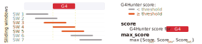
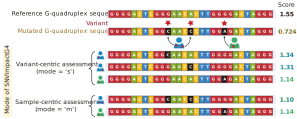

# Introduction


G-quadruplexes (G4s) are non-canonical secondary structures that can form in 
guanine-rich DNA or RNA regions [@varshney2020regulation]. These structures are 
significantly enriched in functional regions like gene promoters 
[@huppert2007g] and telomeres [@phan2002human], and their regulatory roles are 
closely linked to their structures rather than their sequences [@zhang2024g].

Single nucleotide variants (SNVs) are a common type of genetic variation. If 
such a variant occurs within a G4 region, it may affect the formation of that 
G4 structure.

`G4SNVHunter` is designed to evaluate the potential impact of SNVs on G4 
formation, but it can also be used to assess single nucleotide polymorphisms 
(SNPs). This package leverages the highly effective G4 structure prediction 
algorithm, G4Hunter [@bedrat2016re], which was conceptualized by Mergny et al. 
[@bedrat2016re]. One of G4Hunter's notable advantages is that it will evaluate 
the propensity of G4 structures within a specified window, effectively taking 
into account the influence of flanking sequences on G4 formation, not just the 
G4 sequence itself. 

`G4SNVHunter` only requires users to provide genomic sequence data 
(`DNAStringSet` object) and substitution information of variants 
(`GRanges` object) to quickly determine which G4 structures may be affected by 
SNVs (or SNPs). We simplify the analysis process by integrating complex 
functionality into a simple function that can be used even by those 
inexperienced in G4 research or basic programming skills. Users can 
subsequently design *‘wet’* experiments based on the results of `G4SNVHunter` 
to further explore the mechanisms by which variants affect biological 
regulatory functions through their impact on G4 structures.

# Installation

As the first step, you need to install `G4SNVHunter`, which can be done with a 
simple command, 
please ensure that your network connection is stable.

```{r install_G4SNVHunter, eval = FALSE}

if (!requireNamespace("BiocManager", quietly = TRUE))
    install.packages("BiocManager")

BiocManager::install("G4SNVHunter")

```

Then load `G4SNVHunter` to access its functions.

```{r load_G4SNVHunter, message = FALSE}

library(G4SNVHunter)

``` 

# Packages required for the tutorial

During this tutorial, we might need to use a few additional packages. We 
recommend installing them in advance to ensure the tutorial code runs smoothly.

```{r install_required_pkg, eval = FALSE}

if (!requireNamespace("BSgenome.Hsapiens.UCSC.hg19", quietly = TRUE)) {
    BiocManager::install("BSgenome.Hsapiens.UCSC.hg19")
}

if (!requireNamespace("GenomicRanges", quietly = TRUE)) {
    BiocManager::install("GenomicRanges")
}

if (!requireNamespace("DT", quietly = TRUE)) {
  install.packages("DT")
}

if (!requireNamespace("rtracklayer", quietly = TRUE)) {
    BiocManager::install("rtracklayer")
}

``` 

Then, load these packages.

```{r load_required_pkg, message = FALSE, warning = FALSE}

library(BSgenome.Hsapiens.UCSC.hg19)

library(GenomicRanges)

library(DT)

library(rtracklayer)

``` 

# Input data

`G4SNVHunter` requires you to provide two types of data: 

 * the genomic sequences (a `DNAStringSet` object)
 
 * the set of SNVs or SNPs (a `GRanges` object) 

While the input formats for these data are quite flexible, they must ultimately 
be converted into the appropriate formats: `DNAStringSet` for sequences and 
`GRanges` for SNVs. 

Detailed descriptions on how to prepare and format these inputs are provided 
below.

## Genomic sequences

The genomic sequences refer to the sequence of the chromosome or fragment where 
your SNVs (or SNPs) are located. They can be complete chromosome sequences or 
large fragments extracted from chromosomes.
We will predict G4 structures from the sequences you provide and analyze 
whether these SNVs can affect their formation.

Please note that the coordinates of your SNVs must be relative to the genomic 
sequence you provide, and they should be in `1-based` coordinates.

The genomic sequences need to be processed into a `DNAStringSet` object. We 
provide a built-in function, `loadSequence`, to facilitate this processing. Of 
course, you can also load your customized sequence file and convert it into 
a `DNAStringSet` object without using `loadSequence` function.

`loadSequence` mainly accepts three types of input:

 * A two-column `data.frame`, with the first column containing the sequence 
 identifiers and the second column containing their corresponding sequences. 
 This should be specified using the `genome_seq` parameter.

 * The path to a stored FASTA file. The FASTA file must have a `.fa`, `.fna`, 
 or `.fasta` extension. This should be specified using the `seq_path` 
 parameter.

 * A text file (`.txt`) that stores the sequence identifiers and their 
 corresponding sequences. The first column should contain the sequence 
 identifiers, and the second column should contain the sequences. This should 
 also be specified using the `seq_path` parameter.  
 Note: Please do not include column names in the file!

Here are some examples for you to load sequences into a `DNAStringSet` object 
using `loadSequence` function:

Load from a `data.frame` object

```{r load_seq_from_df_using_loadSequence}

seq_df <- data.frame(chr = c("seq1", "seq2"),
                     sequence = c(paste0(rep("G", 100), collapse = ""), 
                                  paste0(rep("A", 100), collapse = "")))
seq <- loadSequence(genome_seq = seq_df)

```

Load from a `fasta` file

```{r load_seq_from_fa_using_loadSequence}

# File path to the sequences in fasta format
fa_path <- system.file("extdata", "seq.fa", package = "G4SNVHunter")
seq <- loadSequence(seq_path = fa_path)

```

Load from a `txt` file

```{r load_seq_from_txt_using_loadSequence}

# File path to the sequences in txt format
txt_path <- system.file("extdata", "seq.txt", package = "G4SNVHunter")
seq <- loadSequence(seq_path = txt_path)

```

We can also obtain genome sequences for some common species from 
[Bioconductor Annotation Packages](
https://www.bioconductor.org/packages/release/data/annotation/).
While this is convenient, it requires you to install some related packages in 
advance. 
For example:

```{r install_hg19_refseq, message = FALSE, warning = FALSE}

# Load sequence for chromosome 21 (hg19)
hg19 <- BSgenome.Hsapiens.UCSC.hg19
chr21_seq <- DNAStringSet(hg19$chr21)
# Chromosome names are needed for analysis
names(chr21_seq) <- "chr21"

```

## SNV data

The SNV (or SNP) data needs to be processed into a `GRanges` object. Since the 
form of SNV data is too flexible, we do not provide a function to load SNVs 
here. However, you can easily load and convert SNV data into a `GRanges` object 
yourself. 
For example,

```{r load_SNV, message = FALSE}

# Path to SNPs
snp_path <- system.file("extdata", "snp.txt", package = "G4SNVHunter")
# Load SNPs into memory
snp <- read.table(snp_path, sep = "\t", header = FALSE)
# Convert snp to GRanges
snp <- GRanges(seqnames = snp$V1,
               ranges = IRanges(start = snp$V2, width = 1),
               rsid = snp$V3,
               ref = snp$V4,
               alt = snp$V5)
print(snp)

```

## SNV data validation

We provide a built-in `checkSNV` function for you to verify whether your SNV 
(or SNP) data meets the requirements of our program.  

However, it is not necessary to run this function explicitly, as our program 
will automatically perform the checks at the appropriate stages. Nevertheless, 
performing a proactive check is always a good practice.

```{r check_SNVs}

gr <- GRanges(
  seqnames = Rle("seq1"),
  ranges = IRanges(c(100, 200, 300), width=1),
    ref = c("A", "C", "G"),
    alt = c("T", "T", "A")
  )
# Check width ('w'), ref ('r'), and alt ('a')
# Returns TRUE if it passed the validation
checkSNV(gr, mode = "wra", ref_col = "ref", alt_col = "alt")

```

# Predict G4s

## Leverage G4Hunter for G4 detection

You can use the `G4HunterDetect` function to directly predict G4s from a 
`DNAStringSet` object containing sequences based on G4Hunter algorithm.  
For example,

```{r predict_G4s}

# Sequence file in fasta file format 
fa_path <- system.file("extdata", "seq.fa", package = "G4SNVHunter")
# Load sequences
seq <- loadSequence(seq_path = fa_path)

# Predict G4s
G4_detected <- G4HunterDetect(seq)

```

Then, we can examine the prediction results, which are stored as a `GRanges` 
object. 

You can use functions like `print` to directly view the results. However, in 
this instance, we'll leverage the [`datatable`](https://rstudio.github.io/DT/) 
function to view the predicted G4s, as this method provides a more 
user-friendly display. 

Let's take a look at the G4s,

```{r print_G4s, warning = FALSE, message = FALSE}

datatable(as.data.frame(G4_detected), options = list(scrollX = TRUE))

```

This function will return a `GRanges` object containing all potential G4s 
predicted by the G4Hunter algorithms. It mainly includes:

 * The sequence identifier where the G4 is located (`seqnames`),

 * The position of the G4 relative to the sequence you provided 
 (`ranges`, `1-based` coordinate),

 * The strand on which the G4 is located (`strand`), with `+` indicating the G4 
 is on the positive strand, and `-` indicating it is on the negative strand,

 * The G4Hunter score for the G4 (`score`),

 * The maximum G4Hunter score of the windows covering that G4 during the 
 execution of the G4Hunter algorithm 
 (`max_score`, used to determine if the G4 surpasses the threshold),

 * The predicted G4 sequence on the positive strand (`sequence`, with C-rich 
 means G4s on the reverse strand).

Please note that `score` reflects the precise score of the G4 sequence, while 
`max_score` represents the highest score obtained by sliding a window across 
that G4.

See the illustration below.

```{r G4_score_maxscore, echo=FALSE}



```

Some parameters for prediction can be customized.
For example,

```{r predict_G4s_parameters}

# Predict G4 by customizing other parameters
G4_detected <- G4HunterDetect(seq, threshold = 1.5, window_size = 20)

```

 * `threshold`: G4Hunter will search for G4s in windows above this threshold 
 (absolute value). Default is `1.5`. Unless there are special needs, we do not 
 recommend setting the threshold below `1.2`.

 * `window_size`: The window size (bp) for G4Hunter prediction. 
 Default is `25`. 
 Another commonly used window size is `20`. However, `25` is generally 
 preferred unless otherwise required.

 * `include_sequences`: Whether to include the predicted G4 sequences in the 
 output. Default is `TRUE`.

 * `strands`: Indicate which strand requires prediction, with `b` for both 
 strands and `p` for positive strand only. Please note that if your genome is 
 single-stranded, this parameter should be set to `p` to prevent the program 
 from predicting G4s on a non-existent negative strand.

We generally do not recommend modifying certain parameters, such as 
`window_size` and `threshold`, as their default settings are already optimal.

## Export prediction results

Since we store the prediction results as a `GRanges` object, exporting is very 
straightforward. 

For example, you can export it into a CSV file,

```{r export_G4_as_csv, eval = FALSE}

# export as csv format
write.csv(as.data.frame(G4_detected), "/path/to/your/file.csv")

```

or export it into other formats as well.

```{r export_G4_as_other_formats, eval = FALSE}

# export as bed format
export(G4_detected, "/path/to/your/file.bed", format = "bed")
# export as bigwig format
export(G4_detected, "/path/to/your/file.bw", format = "bigWig")

```

## Visualize G4Hunter prediction results

You can use `plotG4Info` function for visualizing the statistical information 
of G4s predicted by the `G4HunterDetect` function.

```{r plot_G4, message = FALSE, fig.width = 8.5, fig.height = 8}

plotG4Info(G4_detected)

```

# Evaluate SNV effects

We provide two modes in `SNVImpactG4` function for you to assess the potential 
impact of SNVs on G4s: 

 * Variant-centric assessment (`s` mode)
 
 * Sample-centric assessment (`m` mode)

In short, variant-centric assessment considers the impact of each SNV on the G4 
sequence individually, while sample-centric assessment combines the effects of 
multiple SNVs on a particular G4 for each sample.

See the illustration below.

```{r SNV_effect_interpretation, echo = FALSE}



```

We have prepared example data with variants from chromosome 21 of the human 
genome (hg19), and you can easily load them,

```{r load_example_gr_data}

data(snp_gr)

data(snv_gr)

```

Additionally, you can quickly and conveniently predict G4 sequences on 
chromosome 21 using the `G4HunterDetect` function.

```{r predict_chr21_G4s}

# Predict the G4s in human chr 21 (hg19)
chr21_G4 <- G4HunterDetect(chr21_seq)

```

## Variant-centric assessment

The default mode of `SNVImpactG4` is variant-centric (`mode = 's'`), which 
requires only the G4 data in `GRanges` format (as returned by the 
`G4HunterDetect` function), the SNV data in `GRanges` format, and the column 
name for the alternate bases.

Then, the assessment can be done easily by,

```{r SNV_effects_s_mode, message = FALSE}

snp_eff <- SNVImpactG4(chr21_G4, 
                       snp_gr, 
                       alt_col = "alt")

```

Let's view the first three records,

```{r SNV_effects_s_mode_header3}

datatable(as.data.frame(snp_eff[1:3]), options = list(scrollX = TRUE))

```

`SNVImpactG4` function will return a `GRanges` object that includes detailed 
information about the SNVs (core columns and `SNV.info.*` columns), their 
associated G4 regions (`G4.info.*` columns), and the changes in G4 sequences 
(`mut.G4.seq` and `mut.G4.anno.seq` columns) and G4Hunter scores (`mut.score` 
and `score.diff` column).  

Please note that SNVs located outside of G4 regions will be automatically 
ignored.

## Sample-centric assessment

You can set the `mode` parameter in `SNVImpactG4` function to `'m'` to enable 
sample-centric mode. This mode is particularly useful for specific scenarios, 
such as analyzing SNVs derived from cancer patients.  

When using this mode, you must also specify the column names for sample IDs 
(`sampleid_col`) and SNV IDs (`snvid_col`).

```{r SNV_effects_m_mode, message = FALSE}

# Column names of the Sample ID and SNV ID must be specified
snv_eff <- SNVImpactG4(chr21_G4, 
                       snv_gr, 
                       alt_col = "alt", 
                       mode = "m", 
                       sampleid_col = "sampleid", 
                       snvid_col = "snv_id")

```

Let’s view the first three records,

```{r SNV_effects_m_mode_header3}

datatable(as.data.frame(snv_eff[1:3]), options = list(scrollX = TRUE))

```

It will return a `GRanges` object containing detailed information about the G4s 
(core columns and `G4.info.*` columns). The object will also include the IDs of 
the SNVs (`snv.ids` column) located in the G4 regions, the sample IDs 
(`sample.ids` column), the mutated G4 sequences (`mut.G4.seq` and 
`mut.G4.anno.seq` columns), and the changes in G4Hunter scores (`mut.score` and 
`score.diff` columns).  

Please note that in sample-centric mode, when multiple SNVs from the same 
sample occur within a single G4 region, we will consider the combined impact of 
these SNVs. For example, the following G4 overlaps with two SNVs 
(`id_3608` and `id_49857`) from sample `GQ3Y`, so the final G4Hunter score is 
based on the combined effect of these two SNVs.

```{r SNV_effects_m_mode_example}

datatable(as.data.frame(snv_eff[528]), options = list(scrollX = TRUE))

```

## Filtering potentially affected G4 sequences

Given that some SNVs may have minimal effects on G4 formation, we need to 
filter out those SNVs that are worth investigating further for experimental 
validation or additional analysis. In other words, identifying those variants 
that have the potential to disrupt the G4 structures.

We provide a convenient function, `filterSNVImpact`, to help with this 
filtering process.

There are three threshold parameters for you to adjust: `raw_score_threshold`, 
`mut_score_threshold`, and `score_diff_threshold`.

If `raw_score_threshold` (a positive number) is specified, `filterSNVImpact` 
will filter out records where the absolute value of the original G4Hunter score 
is below this threshold.

If `mut_score_threshold` (a positive number) is specified, `filterSNVImpact` 
will retain records where the G4Hunter score of the mutated G4 sequences does 
not exceed this threshold.

If `score_diff_threshold` (a negative number) is specified, `filterSNVImpact` 
will retain records where the decrease in the G4Hunter score after mutation 
exceeds this threshold.
For example, if `score_diff_threshold = -0.2`, those records will be retained:
\( \left| \text{G4HunterScore}_{\text{mut_seq}} \right| - \left| 
\text{G4HunterScore}_{\text{raw_seq}} \right| \leq -0.2 \)

Our recommendation is that `raw_score_threshold` should be greater than 1.5, 
and the `mut_score_threshold` should be less than 1.2. This is an empirically 
based guideline, and you are certainly free to adjust them to be more stringent 
or to use these parameters for flexible customization as needed.

Please note that you must specify at least one threshold parameter, but you do 
not need to specify all of them.

For example, using the results returned in mode `m`

```{r filter_SNV_impact}

filtered_snv_eff <- filterSNVImpact(snv_eff,
                                    mut_score_threshold = 1.2,
                                    score_diff_threshold = -0.35)

```

We can examine the filtered records to identify SNVs that have a substantial 
impact on G4 formation.

```{r view_SNV_significant_impact}

datatable(as.data.frame(filtered_snv_eff), options = list(scrollX = TRUE))

```

The final results can be saved to a file similarly to how G4 prediction results 
are saved, as described in [Section 5.2](#export-prediction-results).

## Visualize changes in G4Hunter scores

You can use the `plotSNVImpact` function we provide to visualize changes in 
G4Hunter scores. This function is suitable for both variant-centric and 
sample-centric output data, as well as their filtered outputs.

We can observe that mutated G4 structures generally exhibit a trend of 
decreased formation potential.

```{r eff_plot, fig.height = 3, message = FALSE}

plotSNVImpact(snv_eff)

```

Let’s `examine` how the G4Hunter scores have changed in the `filtered_snv_eff`
object.

We observe that the scores for the filtered G4s have decreased significantly.

```{r eff_plot2, fig.height = 3, message = FALSE}

plotSNVImpact(filtered_snv_eff)

```

## Plot the seqlogo for mutated G4 sequences

Finally, we can use `plotImpactSeq` to visualize the G4 sequences affected by 
SNVs. 

For example, we can plot the sequence logos for the top five G4s with the most 
significant changes in their G4Hunter scores.

```{r seqlogo_plot, fig.height = 8, fig.width = 10, message = FALSE}

top5_snv_eff <- filtered_snv_eff[order(filtered_snv_eff$score.diff)[1:5]]
plotImpactSeq(top5_snv_eff, ncol = 2)

```

# A coherent example

Let's explore a coherent example to predict the potential impact of SNVs on G4 
formation. 

Suppose you already have the sequences saved as a `DNAStringset` object 
(`chr21_seq`) and the SNVs saved as a `GRanges` object (`snv_gr`), then execute 
the following code,

```{r coherent_example, eval = FALSE}

# First step, predict G4s
chr21_G4 <- G4HunterDetect(chr21_seq)

# Second step, evaluate the impact of SNVs on G4s in 's' mode
snv_eff <- SNVImpactG4(chr21_G4, snv_gr, alt_col = "alt")

# Filter the results under default parameters
filtered_snv_eff <- filterSNVImpact(snv_eff, mut_score_threshold = 1.2)

# export as csv format
write.csv(as.data.frame(filtered_snv_eff), "/path/to/your/file.csv")

```

# Acknowledgements

The author would like to thank Dr. [Wenyong Zhu](
https://orcid.org/0009-0001-0707-135X) and Dr. [Xiao Sun](
https://orcid.org/0000-0003-1048-7775) from Southeast University for their 
contributions: Dr. Zhu for providing the illustrations and testing the package, 
and Dr. Sun for reviewing this Vignettes.

# Session Info
```{r session_info}

sessionInfo()

```

# References
